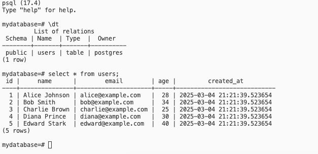

# Servidor Postgres Dockerizado
**Requisitos**: Debes de tener instalado docker en tu máquina.

### Utilería para desplegar un servidor postgresql en un contenedor docker.

**Descripción**: El servidor se inicializará con una base de datos llamada: **mydatabase** con una tabla **users** con **5 registros insertados**.

<br>
<br>

**Este repositorio tiene las siguientes carpetas y archivos:**

<div style="display: flex; flex-direction: row;align-items: center;">
 
 <span style="font-size: 16px; margin-left:10px;font-weight: bold">sql:</span>
 <span style="font-size: 16px; margin-left:5px">
 Contiene los scripts SQL para poblar la base de datos con tablas y registros de users.
</span>
</div>

<div style="display: flex; flex-direction: row;align-items: center; margin-bottom:10px">
 
 <span style="font-size: 16px; margin-left:10px;font-weight: bold">deploy.sh:</span>
 <span style="font-size: 16px; margin-left:5px">
 Bash Script para desplegar el servidor.
</span>
</div>

### ¿Cómo levantar el servicio?

### Paso 1.- Descargar el repositorio:

```bash
# Clonamos el repositorio
git clone https://github.com/soydvaldez/infra.git

# Nos posicionamos sobre la raíz del espacio de trabajo:
cd infra/
```
*** 
### Paso 2.- Levantar el servicio 
  - 2.1 Copia y pega el siguiente comando en tú terminal
  - 2.2 Mediante el script **deploy.sh**

##### 2.1 Copia y pega el siguiente comando en tú terminal:
```bash
docker run \
  --name db-postgres \
  -p 5432:5432 \
  -e POSTGRES_USER:postgres \
  -e POSTGRES_PASSWORD=postgres \
  -e POSTGRES_DB=mydatabase \
  -v ./sql/users.sql:/docker-entrypoint-initdb.d/users.sql \
  -it --rm \
  -d \
  postgres:17-alpine
```

##### 2.2 Mediante el script **deploy.sh**:

```bash
# Dará privilegios de ejecuccion para el usuario actual:
chmod u+x deploy.sh

# Correr el script:
bash deploy.sh
```
***
### Paso 3.- Verificamos los logs del servidor para verificar que haya levantado correctamente
```bash
 docker logs -f db-postgres
```

Con estos sencillos pasos tendremos un servidor corriendo por el puerto 5432 en localhost

### Paso 4.- Realizamos una conexión con psql (u otro cliente de tú preferencias)
```bash 
 docker exec -it db-postgres psql -U postgres --db=mydatabase   # No requiere password
```

o usando el cliente psql desde localhost:

```bash 
 psql -h localhost -U postgres --dbname=mydatabase   # Password: postgres
```

### Paso 5.- Listamos las tablas y consultamos los usuarios:
```sql
\dt
select * from users;
```
